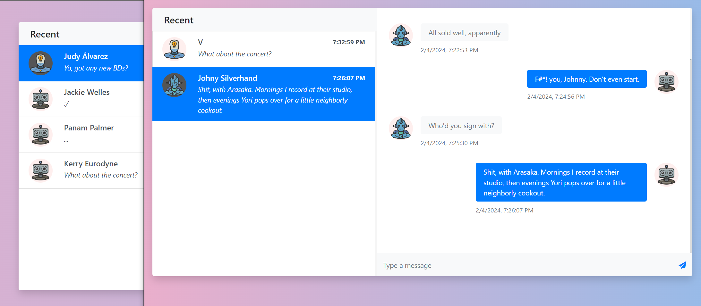

# ChatApp demo

Simple chat program for demo purposes built with PHP Symfony, 2 UI frontends (Vue+React) and using [Mercure](https://mercure.rocks/) for **S**erver-**s**ent **E**vents.

- Based on tutorial videos from: https://www.youtube.com/playlist?list=PLqhuffi3fiMPB-KcuIkd2qh59wN4cG2fp
- Template used from: https://bootstrapious.com/p/bootstrap-chat
- Avatar images from: https://humanistavatars.com/products/free-pack/

### Stack
- Symfony 7
- Vue 3
- React 18 + Redux Toolkit
- PostgreSql
- Mercure
- Docker Compose

To access React UI, GET parameter with name 'react' must be passed, i.e.: http://localhost:8000?react
